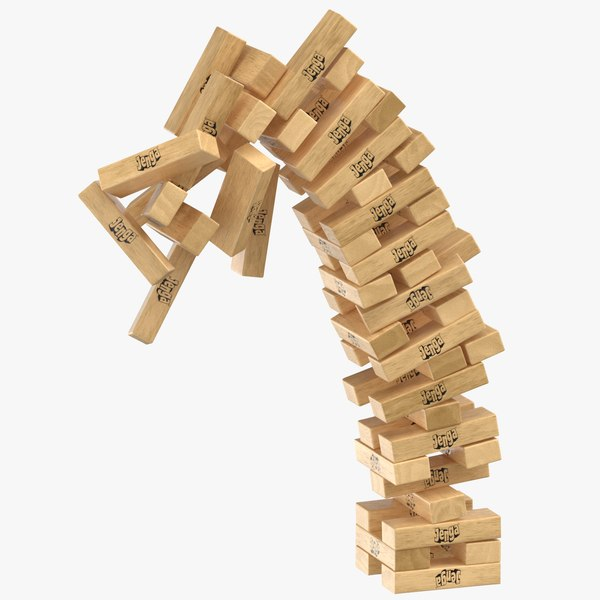

Everyone has their favorite products. For many, it's products that make their lives easier, simplify their daily tasks, save them time (or money), and ideally bring them joy while doing all of the above.

Users don't think about their favorite products as in-depth as one might expect from a Product Manager. When interviewing for a PM job, a typical question could be what your favorite product is. This type of question aims at your ability to think about products from many perspectives:

```markdown
- What problems does your favorite product solve?
- How does it solve these problems?
- Who is the user? No, really - who is it?
- How does it fare against alternatives?
- How would you improve it?
```

Understanding this question and, more importantly, nailing it during an interview should be pretty straightforward. There are [books](https://www.crackingthepminterview.com/) and [articles](https://igotanoffer.com/blogs/product-manager/favorite-product-interview-question) on this topic that explain in detail how to cover the aforementioned questions so that your interviewer is satisfied, and you are one step closer to your dream job.

When I asked this question to candidates, they would often mention products that they were using daily, such as their favorite apps or devices. For many, their favorite product was a decision between two and three products they are actively using, without much thought spent on the context in which they're being asked this question. To be fair to them - the question typically is phrased as "What's your favorite product?" and not e.g., "What's your favorite online marketplace?".

I recently helped a friend prepare for an interview, and we discussed how tackling this question from a different angle could really highlight his product sense and design skills. Given he was interviewing for a company that produces games (e.g., cards, board games) I suggested he prepare for this question by thinking of a physical game that he adores.

I couldn't help but think of a game myself and chose [Jenga](https://en.wikipedia.org/wiki/Jenga). 


*Jenga Tower*

> Jenga is a game of physical skill [...]. Players take turns removing one block at a time from a tower constructed of 54 blocks. Each block removed is then placed on top of the tower, creating a progressively more unstable structure. The game ends when any portion of the tower collapses, caused by either the removal of a block or its new placement. The last player to complete a turn before the collapse is the winner. 

Games don't leave much interpretation for the problem they're trying to solve - being fun. There are games with a mission to educate and empower the player, but we're not going to go into that.  

Jenga is one of the few games that I can think of that can be played by players of almost any background. There are no cultural or technical barriers that block someone from picking blocks and placing them atop the tower. You could probably play Jenga with the first humans, who lived thousands of years ago. In fact, I'm not sure whether there's a way to prove that they haven't been playing their own version of Jenga. The game is super inclusive, transcends age, and has a unique thrill to it, that can only be described as a delicate balance between strategy and suspense. In terms of feedback and excitement, I think the tumbling tower has little competition across tabletop games.

If I had to improve one thing about Jenga, it'd be introducing different game modes as part of the out-of-box experience. You can:

```markdown
- build your own tower
- play with a clock similar to blitz chess
- roll dice to determine whose turn it is
```

Ultimately, these modes are already achieved with a smartphone by your side, but they're not quite as "discoverable" to the average user.

Much of thinking of favorite products is limited to everyday use, while there are probably many more products people love that don't come to mind immediately. From kitchen gadgets to nostalgic board games, favorite products take many shapes, and understanding what makes them great is a great exercise.


