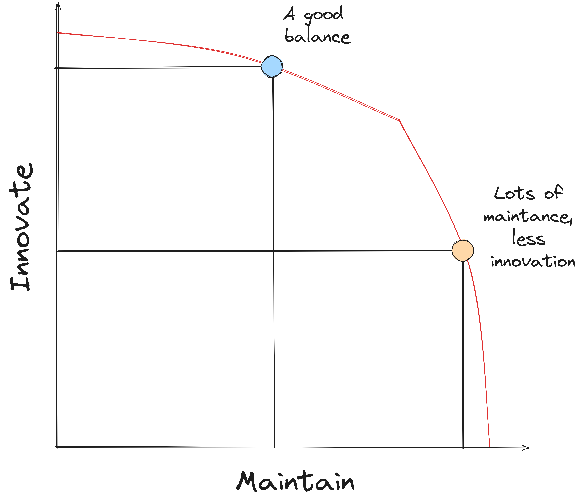
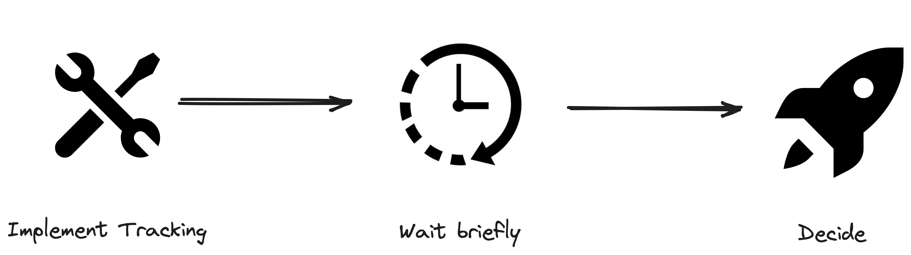
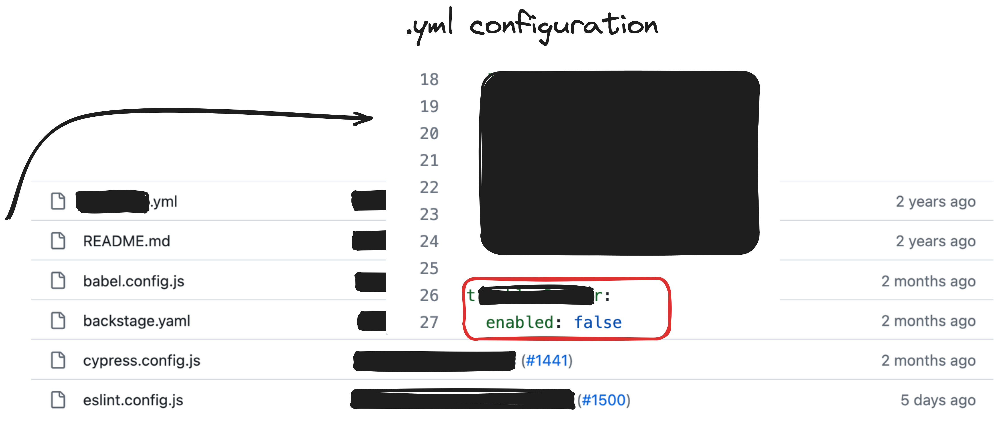
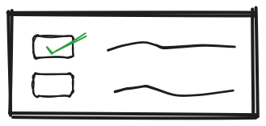
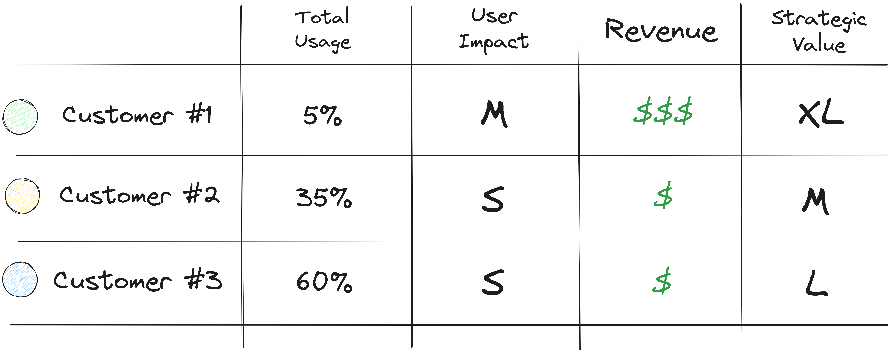

In the fast-paced tech world, change is inevitable. With advancement, old products or features often need to be phased out — a process known as deprecation. Whether you're retiring a legacy system or updating your software (APIs, SDKs, etc), deprecating technical features is a critical yet challenging task.

## The Cost of Maintenance

### Engineering Effort
This goes almost without saying, but maintaning product takes time. Regular updates, bug fixes, and compatibility checks require continuous attention from the engineering team, diverting resources that could otherwise be used for innovation and new developments.

### Opportunity Cost
Unless you're scaling up, your capacity is likely limited and every bit of effort you spent in maintaining products comes at the cost of not innovating. Managing lifecycles of your products is a necessity, when you want to stay connected to the needs of your users and discover new high value initiatives.

In the following diagram, the red line indicates our capacity. Anything beyond it, is out of our reach. Improving on one aspect, comes at the cost of another.

*Production Possibility Frontier - Opportunity Cost*

We want to strike a good balance between maintaining products and innovating. This essentially means that we continously have to prioritise updates, ensuring backwards-compatibility, bug fixes and other maintenance tasks vs. new feature requests.

Otherwise we risk falling behind and lose our competitive edge in the market. The goal should be sustained growth and user satisfaction, all while staying ahead on e.g. technological advancements and industry trends.

<!-- ## Strategic Fit
Like most product decisions, we want to establish a strategic fit for our work. The decision to maintain or deprecate a product must contribute to the greater strategy, as anything else would not bring us closer to our goals.
-->

<!-- - deprecation rationale
    - strategic fit
    - quant - what is being used to what extend
        - gather data if necessary
    - qual - WHO and WHY are they using it?
        - speak to the community
        - reach out and verify assumptions -->

## User Impact
One of the first things we want to do, when deprecating products, is to understand the potential user impact. Who would be affected by this deprecation and how would they be affected? What are their use cases and how do you account for those after the deprecation?

Try to understand the usage from a quantitative perspective first, to get a good overview of what's going on. Ideally you have this data ready, because tracking usage retrospectively can be quite challenging.

### Gathering Data
Although not ideal, it's very common for data to be missing. Sometimes not every interactionis tracked or the product was built in a hurry and it was just good enough.

When you don't have the data, but you still want to make a data-driven decision here's some ideas:

#### Ad-hoc Tracking

*Implement Tracking ad-hoc*

This seems rather obvious, but by building tracking now you can already have a good idea of usage within a week. This approach obviously has drawbacks and strongly depends on your product. Perhaps usage is sporadic and one week is not enough time or you need more historic data to make a decision.

Nevertheless, building tracking into your product will come in handy, when we discuss metrics for the deprecation proces.

#### Analyse configurations

*Analyse Configurations*

It might be helpful to scan for configurations or source code to understand how your product is used. This works well for internal products, where you might have access to source control.

#### Surveys

Asking your users about their usage of your products is another alternative. Additionally you have the option to ask them of demographics such as company size, team and their own role, which will help you create segments and make your decisions more nuanced.
Surveys are somewhere between qualitative and quantitative data. Keep in midn that their results might not be representative.

## Understand Usage
Think beyond users and extend your understanding of usage to the scope of customers. A user can be a single developer, but the customer is the company that employees the developer. Try to understand who has the decision authority to continue using your product. Will they continue using your products after deprecation or look for alternatives?

*Usage by Customer - Last month*

### Speak to your users
Next, you'd want to understand customer use cases and the impact a deprecation would have on them. This can be anything from just updating to the latest supported version or even adopting a completely new product. The effort they need to spent on the deprecation needs to be well understood from your end. Consider that large corporations have quarterly planning processes and the deprecation of your product needs to be considered as a part of that.

When in doubt, reach out to them to get a feeling for the required work on their end. You want to set realistic timelines for your users, while making sure that you move forward with the deprecation as necessary. The aforementioned survey can help you find out more.

## Deprecation Rationale

After understanding user impact, you want to look closer at what this customer means to your business. An almost too simple metric to look at is the revenue they bring in. Another could be the strategic value this customer represents. Do you expect them to stay loyal? Perhaps buy into more of your products?

*Customer Matrix*

You want to avoid basing your reasoning for deprecation solely on low usage. Usually this is a good indicator that you should have a closer look though. If your biggest customer is in the low usage bracket, you will need to make a good case for deprecation.

**WIP: This article is not finished yet. Stay tuned 🤞🏻**

<!-- - stakeholders

- success metrics

- timelines and release schedules

- risks -->
