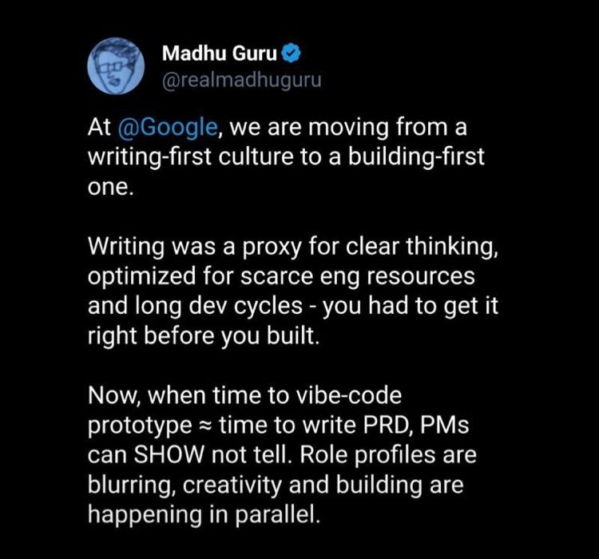
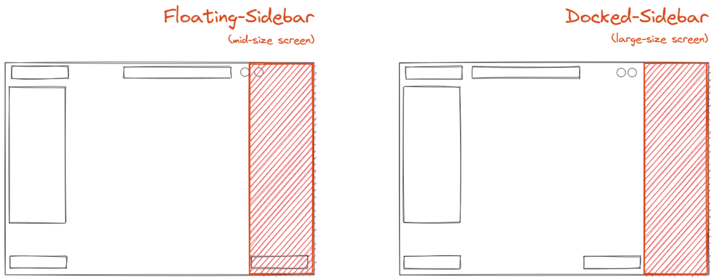
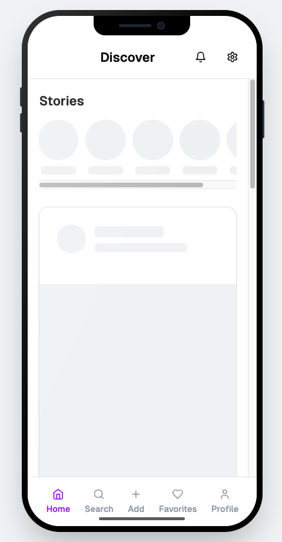

For a PM, AI should stand for “An Intern”.

Summarise this, organize that, do some market research, let me dictate an idea and  draft it into something coherent. It should do the heavy-lifting on time intensive, repetitive and structured tasks to free up time so I can focus on product strategy, creative problem-solving, and stakeholder management.

In this post, I’ll walk through the different ways I use AI day-to-day to boost my productivity as a PM.

## Brainstorming

Disclaimer: I assume ChatGPT [knows nothing](https://www.youtube.com/watch?v=LPZh9BOjkQs|) and treat everything it claims carefully. I ask it to provide sources, then review the source, author, and number of independent references before forming my own opinion.

I treat AI like a sparring partner. I can throw out half-baked ideas and let it push back, fill in missing information, or poke holes in my reasoning. It’s great for breaking through writer’s block, exploring alternative angles, and stress-testing assumptions — but it doesn’t replace my own thinking. Just like a good sparring partner, it’s there to challenge me and make my ideas sharper, not to do the thinking for me. 

My use of AI in this way extends beyond my job. I’ll often bounce personal projects, learning goals, or even hobby-related ideas off it to get a fresh perspective and refine my thinking.

## Writing Documents

I’ve seen the recent trend of “build first” over “write first”. Most of it tracks back to a Google PM claiming that they moved away from documentation heavy approaches.

*Google PM on writing vs. building - @realmadhugura on Twitter*

Coincidentally this person is leading Gemini, so they have some stake in claiming these things. I'd take it with a grain of salt when someone and their employer benefit from claims.

So, I don’t fully agree. PRDs are more than a spec sheet - they’re a living document that forces me to structure my thinking. In practical terms, it means understanding the problem, defining goals and success metrics, drafting a key set of features and user flows, a launch roadmap and seeking alignment with stakeholders. In the worst case, a PRD is still a way to document the product and decisions that have been made. Vibe-coding a prototype does not give you that (yet?) and should instead be used to complement a PRD.

I use ChatGPT to draft PRDs, which gives me a strong starting point. The draft is rarely final, but it’s often halfway there. If the topic is unfamiliar or complex, I’ll run a DeepResearch query first, give it a focused read, then feed that into the PRD draft step. DeepResearch has proven to be incredibly useful for ramping up on any topic and with the right guidance, it can dissect competitor strategies, highlight feature gaps, and even suggest a roadmap.

## Writing User Stories

This is where AI saves me the most time. I’ve trained it on several templates (epics, stories, bugs), so it remembers the structure for all future queries. 

(This is also where I see the most potential for AI "taking over my job". Ideally, I'd feed it a PRD and the application code as context and it'll create the necessary tasks, ready to hand over to engineers.)

Often, I’ll dump voice notes (speech-to-text) or a rough text block with all the context I have — PRD, feature request, slack threads, screenshots, data, etc. — and let it structure and polish the ticket. It takes me another read to add additional information and remove redundancies or hallucinations, but it's 90% there most of the time.

## Prototyping with v0

I use [Vercel's v0](https://v0.dev/) to spin up prototypes quickly. Before, I relied on low-fidelity sketches in Excalidraw, but now I can create higher-fidelity prototypes that better communicate my vision.

The prototypes aren’t just clickable mockups, they’re interactive models that cover basic UI and, when needed, simulate flows or logic to make the concept feel more real.

*Excalidraw Sketch* 

Pro Tip: Use a separate, non-responsive [mobile prototype](https://v0-mobile-website-prototype-tau.vercel.app/) that non-technical stakeholders can easily interact with.

*v0 prototype*

In the future, I’d like to prototype directly on our product’s codebase. While LLMs still struggle with very large repositories, I believe setting up a local environment and guiding an agent through smaller, focused parts of the code could bridge the gap. This would allow for faster iteration on actual product features rather than abstract prototypes, and potentially help engineers visualize changes even better before writing production code.

This month, ChatGPT released GPT-5, which has built-in frontend capabilities for creating and running interactive prototypes directly in the chat. It also features easy /[link sharing](https://chatgpt.com/canvas/shared/68971649c330819197771daaea94408e) so stakeholders can try them out without needing special tools or local setup, making early feedback much faster to gather. 

v0 offers all of that, plus user collaboration on the same prototype though I haven’t found that feature useful in my workflow. It also supports exporting generated code for quick deployment to Vercel’s cloud. Because v0 uses technologies I already know well (NextJS + Tailwind), it’s an ideal springboard if I choose to develop the prototype into a fully functional product.

## Other Use Cases

##### Data Analysis
AI can help PMs make sense of complex datasets, involving multiple segments like device type, customer segment, or listing category.

 It can summarise results, identify trends, and even plot data for quick visualisation — I’ve found Gemini does this better than ChatGPT. 
 
 These tools can be a great crutch for spotting patterns and framing the story the data is telling. But ultimately, any decision should be made by a human understanding the numbers, their limitations, and their context. AI should support, not replace, that critical thinking.

##### Categorise Customer Feedback

We gather feedback from many points in the user journey, but the raw comments are often messy and unstructured. LLMs can quickly tag, group, and summarise them, turning a wall of text into actionable insights.

| verbatim                                                                                  | CSAT_score | category                 |
|-------------------------------------------------------------------------------------------|:----------:|:------------------------:|
| The search filters are confusing and hard to reset once applied.                          | 2          | Search & Filters         |
| I love how quickly the listings load, very smooth experience.                             | 5          | Performance & Navigation |
| The map view keeps freezing when I zoom in to see more details.                           | 1          | Map Functionality         |
| Too many duplicate listings show up in my search results.                                 | 2          | Search & Filters         |
| I like the saved search alerts, they help me stay updated.                                | 5          | Alerts & Notifications    |
| The login process is too complicated, I keep getting logged out.                          | 1          | Account & Login           |
| Property details are very clear, especially the floor plans.                              | 4          | Listing Quality           |

##### Public Writing

For external (and internal) communication like release notes or announcements, AI speeds up drafting while keeping a consistent tone and structure. I supply the template once, provide the core information, and it generates a draft that still needs a quick review and edit, but is essentially ready to send.
