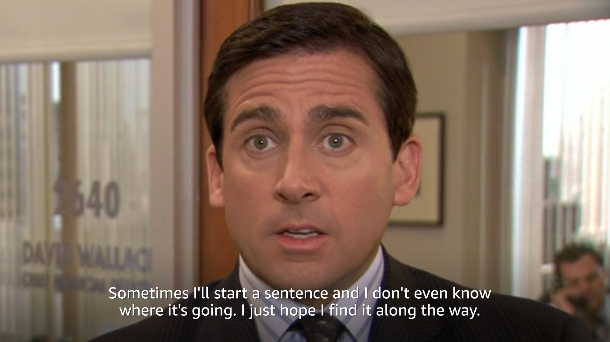
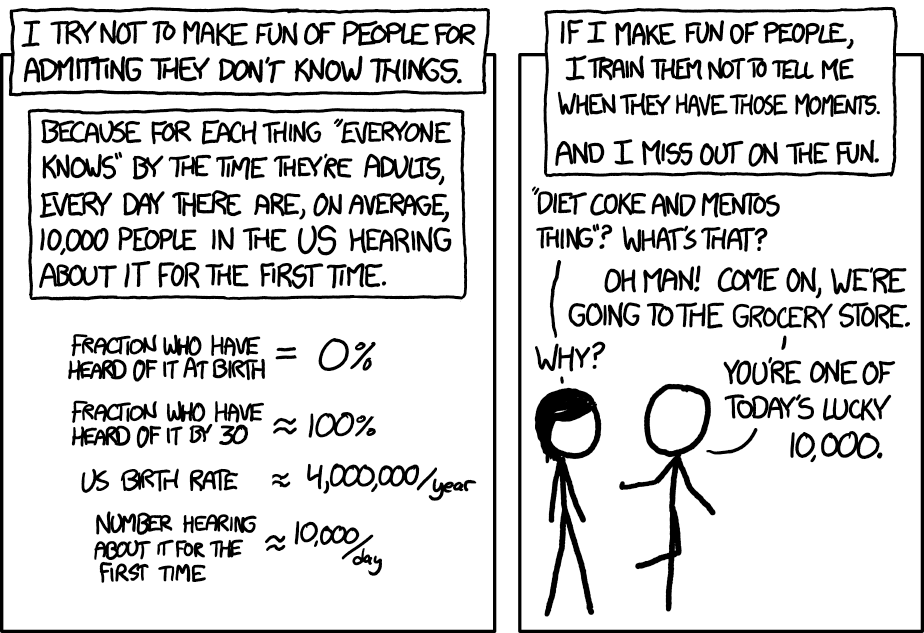
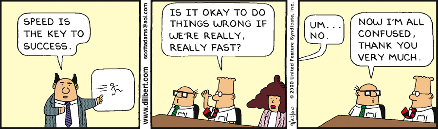

... is what I hear myself say rather often. It might be a different choice of words occasionally (e.g. "Let me get back to you", "I'll look into it"). But the key message is the same - I have no idea, but I'm confident I can find an answer if you give me some time.

I have been (un)fortunate enough to witness the flip side of this quite often as well. It's being asked a question and going on an incoherent ramble for two minutes. Hoping to find the answer along the way, all while derailing the conversation or steering it towards a more comfortable topic to talk about.

*Michael Scott - The Office (2005-2013)*

I think both behaviors can be attributed to the environment an individual is or has been exposed to. Software development is much more forgiving, when you don't know the answer straight away. Technologies change in the blink of an eye and the stakes are probably comparatively low. The world is not going to burn tomorrow, if we can't decide now.

On the other hand, I'd hope that a surgeon knows the answer to a problem in an emergency room. If they'd have to pace back and forth for some hours or rely on an epiphany, chances are they're not very good at their job. They need to know now because the stakes are high and there's little time to think.

There's also an ego component to this. It's not a guarantee that if everyone understood their environment they'd act accordingly. Fear of judgment, lack of humility, and scultural expectations play a role in how someone will respond to a question they don't know the answer to.

*xkcd - 10.000*

Safe environments are the cornerstone of growth and require everyone to participate. These environments foster psychological safety, open communication, and a supportive atmosphere. They allow everyone to take risks, make mistakes, and ultimately learn and grow without fear of negative consequences.

When the environment is right, embrace saying „I don‘t know“. Personally, I find saying this much easier, because I'm confident that I'm knowledgeable on something. This is my mental crutch to comfort myself, when I don't know something else. We all started not knowing anything and the ability to gather knowledge is what sets apart the good from the great.

Depending on the circumstances, answers vary. In fast-paced environments, a quick answer (and action) can trump a well-researched one. Don't neglect moving fast, but understand any tradeoffs you'd have to make to do so. Most importantly, communicate your thought process and what'd you do next.

*Dilbert - Speed*

Become an expert at finding information. Know where to look and how to leverage people in your team, company, and industry. Usually, this is the first thing I do, because it's unlikely that I'm the first person to have or think about a problem. If I don't get an answer here, I'll at least get pointers on where to look next.

Next steps usually require an array of hard skills. Data analysis, research and web search are fundamental skills in information retrieval. Being a leader often means leveraging other people for these tasks as well. However, I find pleasure in finding an answer myself from time to time.

Being able to say "I don't know, but I can find out" is about one's approach to learning. Their environment plays a fundamental role in their approach, but shouldn't be a limiting factor. When stakes are high and time is limited - move fast. Know where to look, leverage people, and know a thing or two about analytics.