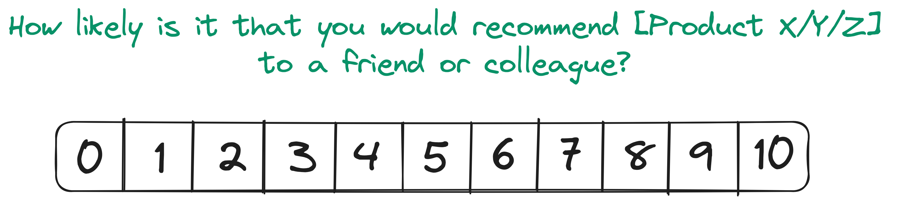
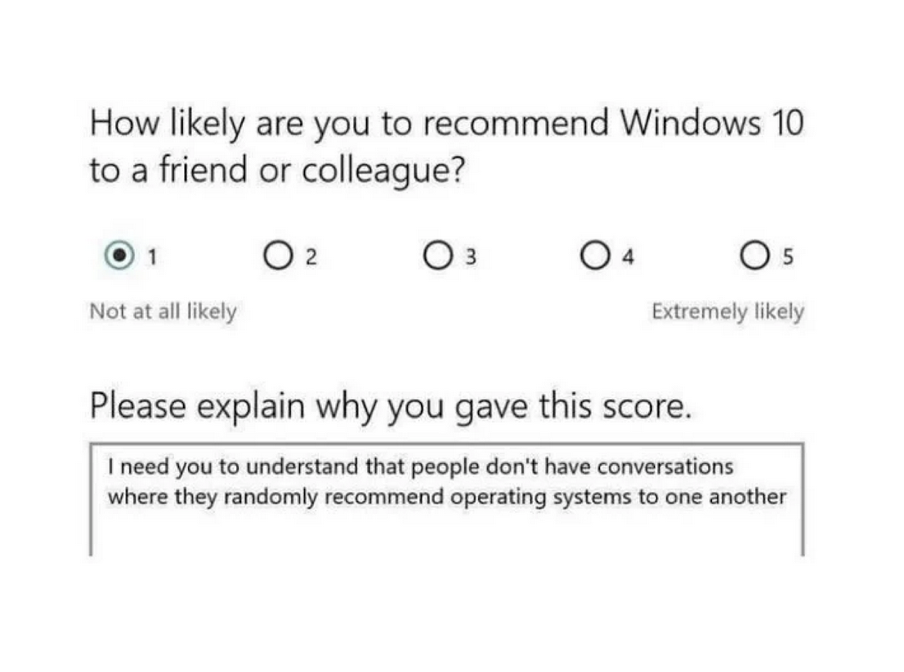

You've just launched a new revolutionary product and senior leadership wants to know how it's doing. They're overseeing many products these days and suggest you go for a metric they're familiar with - the ol' reliable Net Promoter Score (NPS).

You start drafting the survey, but hold up - there are some things you should know first.

### What is NPS?

NPS stands for Net Promoter Score, a metric used to measure customer satisfaction with products. First developed in 2003 by Bain and Company, it has gained popularity among business executives and is considered a widely used instrument for measuring customer loyalty.

It measures customer satisfaction, based on a simple question:


*NPS Question*

Respondents give a rating from 0 (not likely at all) to 10 (very likely) and depending on their response fall into one of 3 categories:

```markdown
😻 **Promoters**
Score (9-10) are loyal customers who will keep using
our product and fuel growth by referring others.

😐 **Passives**
Score (7-8) are not recommending a product,
but are also unlikely to damage it with negative word of mouth.

😾 **Detractors**
Scores (0-6) are unlikely to recommend a product
to others, won’t stick around or repeat purchases,
and—worse—could discourage potential customers
```

Calculating your NPS score is easy - subtract the (relative) number of detractors from the number of promoters. If 80% of respondents are promoters and 10% are detractors, then your score is 70.

Net Promoter Score is always expressed as a number from -100 to 100; the score is negative when a company has more detractors than promoters, and positive in the opposite situation. Creators of NPS, Bain & Company, suggest: Above 0 is good. Above 20 is favorable. Above 50 is excellent.

### Pitfalls

Measuring customer satisfaction with NPS falls flat in many situations. Before choosing and relying on it, consider the following pitfalls.

#### Improving over time

Because NPS defines score ranges for detractors very wide (0-6), you miss measuring the improvements you make over time to your product.

Consider the following survey responses over time:

| | Survey 1 (Q1) | Survey 2 (Q2) |
|--|:----------:|:-------------:|
|User 1 | 3 | 4 |
|User 2 | 1 | 5 |
|User 3 | 2 | 4 |
|User 4 | 2 | 4 |
|User 5 | 2 | 3 |

The score for both surveys equals -100. There is a clear improvement in survey results from quarter to quarter (Q1 avg=2; Q2 avg=4), but all respondents still fall into the (0-6) detractor category.

NPS is blind to any improvements you make over time for users who are not satisfied with your product. This can be especially infuriating if you were to launch a new product, that finds little success initially. Until your users consistently give you scores of 9-10, NPS is not a valuable metric for you.

#### Promotion as a proxy for success

How the NPS question is phrased implies that users will or will not recommend it. It ignores the actual satisfaction customers feel with the product or service.

It becomes obvious when you consider that not all products are discussed extensively among peers (or friends and family).


*Microsoft Windows 10 NPS Survey*

Although discussions about recommending operating systems are a lot more common than this respondent might realize (ask any Linux user), it's still common to send NPS surveys when the intended growth mechanism of a product doesn't align.

I would argue that NPS is measuring _loyalty_ instead of satisfaction. It forces customers to take a much wider view of the brand and product, rather than their overall feeling of satisfaction. If you want to measure satisfaction you can use [CSAT](https://delighted.com/what-is-customer-satisfaction-score).

#### Overreliance on a single metric

This should go without saying, but over-relying on NPS to make decisions is probably not a good idea. Bain & Company, creators of NPS, claim it [predicts overall company growth and customer lifetime value](https://www.bain.com/consulting-services/customer-strategy-and-marketing/net-promoter-score-system/), but this is just overselling their invention. The [relationship between NPS and company growth](https://web.archive.org/web/20200716065914/https://pdfs.semanticscholar.org/dfe0/4f3d83fee37a617d9cacfebc331605dc4bfc.pdf) has long been questioned by scholars.

At [Adevinta](https://adevinta.com/) we recently started measuring developer experience in a company-wide survey. I cannot overstate enough, how difficult it is to effectively measure satisfaction. Developer experience has too many aspects to summarise in a single metric.

The way I see it, NPS became popular because it's an easy-to-digest metric for executives and it trivializes product-market dynamics. NPS is valuable, but it should be complemented with other metrics for a comprehensive understanding of customer satisfaction.

The goal should be about telling a compelling story of customer satisfaction, from many perspectives, captivating and with clear next steps to take.